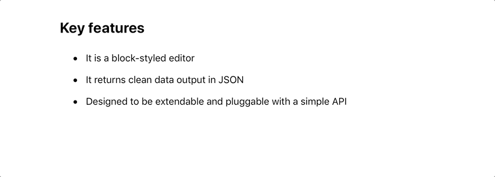

# List Tool for CodeX Editor

This Tool for the [CodeX Editor](https://ifmo.su/editor) allows you to add ordered or unordered (bulleted) lists to your article.



## Installation

### Install via NPM

Get the package

```shell
npm i --save-dev codex.editor.list
```

Include module at your application

```javascript
const List = require('codex.editor.list');
```

### Download to your project's source dir

1. Upload folder `dist` from repository
2. Add `dist/bundle.js` file to your page.

### Load from CDN

Get newest bundle path from [RawGit](https://rawgit.com) — open site and paste link to JS bundle in repository.

`https://github.com/codex-editor/list/blob/master/dist/bundle.js`

> Note: use `production` link with commit hash to avoid issues with caching.

Then require this script on page with CodeX Editor.

```html
<script src="..."></script>
```

## Usage

Add a new Tool to the `tools` property of the CodeX Editor initial config.

```javascript
var editor = CodexEditor({
  ...
  
  tools: {
    ...
    list: {
      class: List,
      inlineToolbar: true,
    },
  }
  
  ...
});
```

## Config Params

This Tool has no config params

## Tool's settings


You can choose list`s type.

## Output data

| Field | Type       | Description                            |
| ----- | ---------- | -------------------------------------- |
| style | `string`   | type of list: `ordered` or `unordered` |
| items | `string[]` | array of list's items                  |


```json
{
    "type" : "list",
    "data" : {
        "style" : "unordered",
        "items" : [
            "This is a block-styled editor",
            "Clean output data",
            "Simple and powerful API"
        ]
    }
},
```

